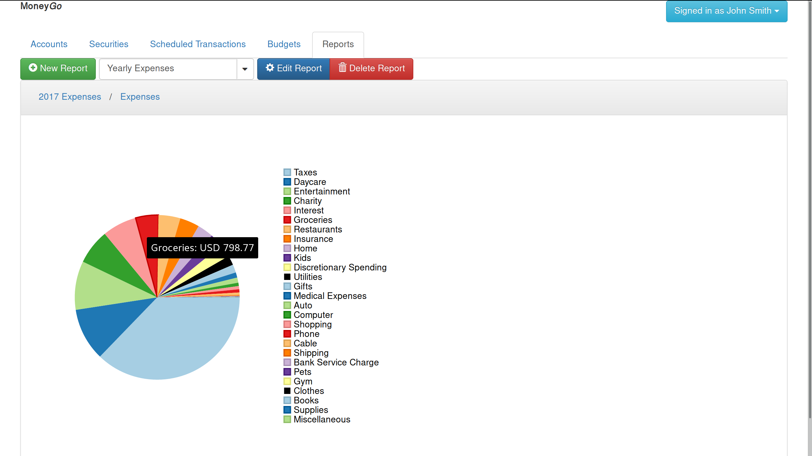
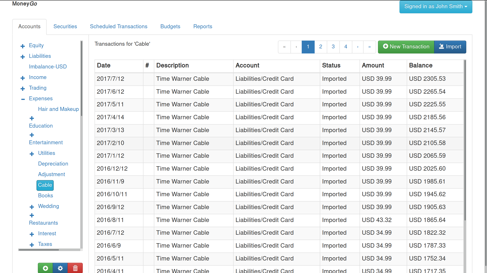
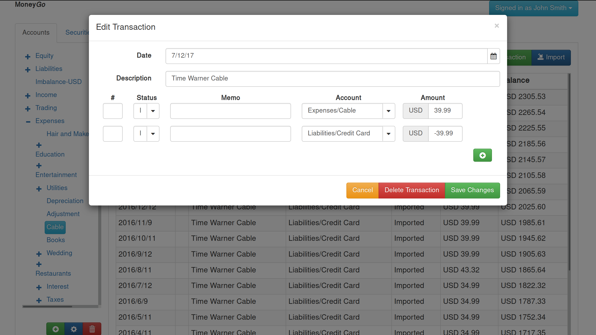

# Tret-Financial

**tret-financial** is a personal finance web application written in JavaScript and
Golang. It adheres to [double-entry
accounting](https://en.wikipedia.org/wiki/Double-entry_bookkeeping_system)
principles and allows for importing directly from financial institutions using
OFX (via [ofxgo](https://github.com/aclindsa/ofxgo)).

This project is in active development and is not yet ready to be relied upon as
your primary accounting software (but please feel free to try it out and offer
feedback!).

## Features

* [Import from OFX](./docs/ofx_imports.md) and
  [Gnucash](http://www.gnucash.org/)
* Enter transactions manually using the register, double-entry accounting is
  enforced
* Generate [custom charts in Lua](./docs/lua_reports.md)

## Screenshots

## Usage Documentation

Though I believe much of the interface is 'discoverable', I'm working on
documentation for those things that may not be so obvious to use: creating
custom reports, importing transactions, etc. For the moment, the easiest way to
view that documentation is to [browse it on github](./docs/index.md).

## Installation

First, install npm, nodejs >= 6.11.3 (may work on older 6.x.x releases, but this
is untested), python, curl, and go >= 1.9 in your distribution. Here is how in
Arch Linux:

	sudo pacman -S npm curl go python

Install browserify globally using npm:

	sudo npm install -g browserify

You'll then want to build everything (the Golang and Javascript portions) using
something like:

	$ export GOPATH=`pwd`
	$ go get -v github.com/aclindsa/tret-financial
	$ go generate -v github.com/aclindsa/tret-financial
	$ go install -v github.com/aclindsa/tret-financial

This may take quite a while the first time you build the project since it is
auto-generating a list of currencies and securities by querying multiple
websites and services. To avoid this step, you can `touch

## Running

Assuming you're in the same directory you ran the above installation commands
from, running tret-financial is then as easy as:

	$ ./bin/tret-financial \
	  -port 8080 \
	  -base src/github.com/aclindsa/tret-financial/

## Missing Features

* Importing a few of the more exotic investment transactions via OFX
* Budgets
* Scheduled transactions
* Matching duplicate transactions
* Tracking exchange rates, security prices
* Import QIF
